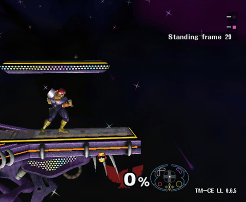

# Training Mode CE + Landing Lab

An unofficial build of [Training Mode - Community Edition](https://github.com/AlexanderHarrison/TrainingMode-CommunityEdition) (TM-CE) v1.4 with one new event: **Landing Lab**, a Captain Falcon trainer that shows NILs, aerial interrupts and wavelands before you land, and teaches the best ledge routes frame by frame.

Everything else is TM-CE as it is. For the full TM-CE feature list, see the [official README](https://github.com/AlexanderHarrison/TrainingMode-CommunityEdition#readme).

> **Not made or supported by the TM-CE team.** Landing Lab was designed and playtested by Stephen ([Crackerfracks](https://github.com/Crackerfracks)) and its code was written with Claude, an AI coding assistant. TM-CE doesn't accept AI-written code, so please send feedback about this build here, not to the TM-CE Discord or repository.

## Install

You need your own copy of **Super Smash Bros. Melee NTSC 1.02** as an ISO. Nothing from the game is included; the download is a patch that turns your ISO into this build.

1. Download `TM-CE-LandingLab-<version>.zip` from [Releases](https://github.com/Crackerfracks/TrainingMode-CommunityEdition/releases) and unzip it.
2. Make the ISO:
    - **Windows:** drag your Melee ISO onto `DRAG VANILLA MELEE HERE.bat`.
    - **Linux / macOS:** install xdelta (`sudo apt install xdelta3`, `sudo pacman -S xdelta3` or `brew install xdelta`), then run `./build_linux_and_mac.sh path/to/melee.iso`.
3. This writes `TM-CE-LandingLab.iso` in the same folder. It never overwrites an official `TM-CE.iso`.
4. Open it in Dolphin (Slippi's Dolphin works). It uses TM-CE's game ID (GTME01), so Dolphin treats it like TM-CE for settings and saves.

If the patch fails, the ISO isn't NTSC 1.02. A clean NTSC 1.02 ISO has the MD5 `0e63d4223b01d9aba596259dc155a174`.

## Start Landing Lab

Event Mode → **Character-specific Tech** page → **Landing Lab** (the last event). Pick Captain Falcon and any stage; it was built and tested mostly on Battlefield. Press **Start** for the menu.

## What it shows

As you move, Landing Lab simulates where Falcon's ECB will land if you keep holding the stick, and marks what's possible on the way:

| Color | Means |
| --- | --- |
| Green | **NIL**: holding the stick lands you straight into standing, no landing lag |
| Pink | **Aerial interrupt (AI)**: starting an aerial here lands you on its first frame, rising or falling, onto a platform or a ledge |
| Cyan | **Perfect waveland or wavedash**: an airdodge just below sideways lands at once with full speed |
| Periwinkle | **GALINT**: ledge intangibility you still have once you can act on stage |

- **Paths**: the landing path (ECB bottom), a dotted body path, and markers where each input is due (white stick, yellow jump, pink aerial with the C-stick directions that work, cyan airdodge).
- **Timer**: frame cells slide into a gate next to Falcon; press when a cell reaches it. Solid cells are presses, hollow ones are touchdowns, the white gate means press now, slate means missed.
- **Spot timers**: brackets close in on the landing spot for an AI or NIL; for a waveland, ticks run in from the ends of the slide.
- **Controller**: your real stick, the band where Melee reads an axis as zero, a trail of recent frames, and the fastfall line, which lights when a flick would fastfall. It moves to stay clear of every player's percent.

<table>
<tr>
<td width="50%" valign="top"> <b>NIL</b></td>
<td width="50%" valign="top"> <b>Perfect waveland</b></td>
</tr>
<tr>
<td valign="top"> <b>Wavedash timer</b></td>
<td valign="top"> <b>Controller display</b></td>
</tr>
</table>

## Ledge Practice

While Falcon hangs on a ledge, Landing Lab lists the routes to the stage that keep the most GALINT: drop, wait, fastfall, double jump, then a NIL or an AI.

- **Route Kind**: NIL, AI or Both. **Route**: Best, Second or Third.
- **Assist**: quicktime practice. The game freezes on each input of the route and waits for you, then plays on at full speed. Shorten **Assist Wait** as the timing sinks in.
- **Reset**, **Reset Delay**, **Starting Position** and **Keep Ledge Invincibility** work like TM-CE's ledgedash event.

<table>
<tr>
<td width="50%" valign="top"> <b>A ledge route into a nair AI</b></td>
<td width="50%" valign="top"> <b>Assist waiting on an input</b></td>
</tr>
</table>

## Controls

| Input | Does |
| --- | --- |
| Start | Open the menu |
| D-pad right (hold) | Save Falcon's position |
| D-pad left | Load the saved position |
| D-pad down | Frame Advance on/off |
| Advance button (L by default, set in Speed) | Step one frame during Frame Advance; hold to step slowly |

## Menu

| Menu | What's in it |
| --- | --- |
| Cues | Which landings get cues (NIL, AI, waveland), the AI filter (Useful or All), body flash, platform glow |
| Paths | Landing and body paths, input markers and their size, frame dots, slide-off line, jump preview |
| HUD | Timer, spot timers, controller display and its look and size, info panel |
| Sounds | Chime on a hit, and which slips buzz |
| Ledge Practice | Routes, Assist, resets, camera |
| Speed | Game speed and Frame Advance |
| Developer | Accuracy count, collision view, debug log, test scripts |

## Known limits

- Captain Falcon only.
- Tested in Dolphin. Not tested on console.
- Paths drawn gray rely on ECB frames the event hasn't seen yet; it learns them as you play.
- Some NILs out of a double jump show up one frame early.
- Once, stray drawings showed up over the version text in the bottom-right corner after toggling options on the ledge, until a restart. If you see it, a photo and what you pressed just before would help a lot.

## Feedback

Found a cue that lied to you, or know a better ledge route? Open an issue on [this repository](https://github.com/Crackerfracks/TrainingMode-CommunityEdition/issues) or message Stephen. If you can, include the stage and the frame you pressed on; Frame Advance makes that easy to count.

## Building from source

See [DEVELOPMENT.md](DEVELOPMENT.md). `./build.sh path/to/melee.iso release` builds the ISO and the release zip. Landing Lab's code is in `src/landinglab.c`.

## Credits

TM-CE by its contributors, maintained by Alex Harrison, built on UnclePunch's original Training Mode. Landing Lab by Stephen (Crackerfracks), written with Claude.
