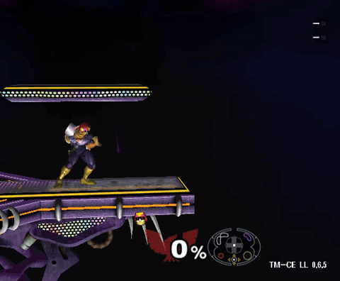
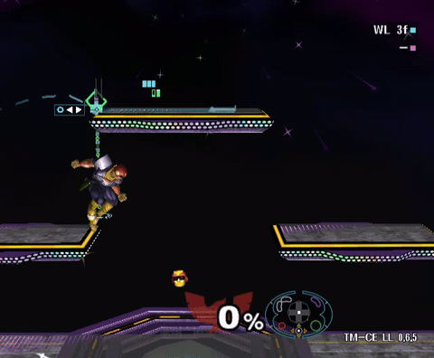
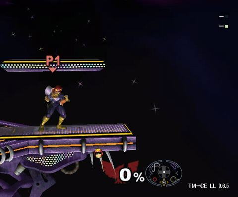
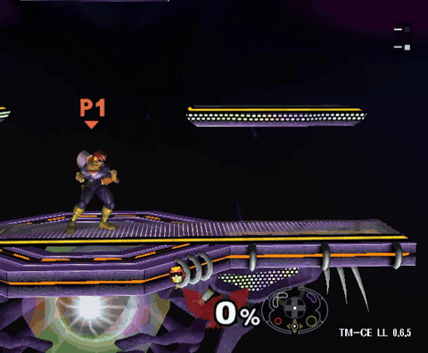
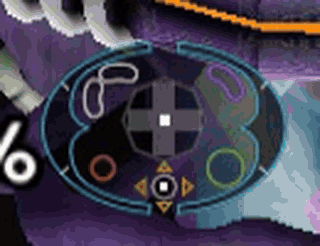
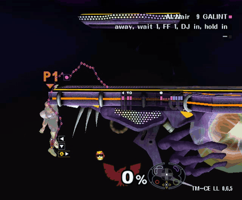
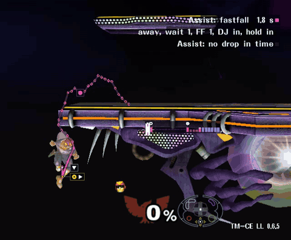

# Training Mode CE + Landing Lab

Jump at a platform, start a nair while you're still rising, and on the right frame Melee decides Captain Falcon has already landed. He skips the rest of his own jump and stands there, ready to act. **Landing Lab** shows you that frame before you get there. The game has worked this way since 2001 and has never mentioned it to anyone.

<!-- GIF to reshoot at 0.8.4 defaults: Battlefield, run off the left platform, double jump, rising nair AI onto the top platform -->

This is an unofficial build of [Training Mode - Community Edition](https://github.com/AlexanderHarrison/TrainingMode-CommunityEdition) (TM-CE) v1.4 with one new event. Everything else is TM-CE as it ships; its [README](https://github.com/AlexanderHarrison/TrainingMode-CommunityEdition#readme) covers the rest.

> **Not made or supported by the TM-CE team.** Landing Lab was designed and playtested by [Crackerfracks](https://github.com/Crackerfracks), and its code was written with Claude, an AI model. TM-CE doesn't take AI-written code, so send feedback here, not to the TM-CE Discord or repository.

## New to Melee?

Welcome. Melee is a 25-year-old party game that a community refused to put down, so now it's a sport. Turn on one thing, go play, and skip every word below you don't recognize. You'll learn them the way everyone does: by getting hit with them.

The two you'll see most: an **aerial interrupt (AI)** is starting an aerial right as you reach a platform, so the game counts you as landed and you skip the rest of the jump. A **NIL** (no-impact landing) is touching down with no landing lag at all.

Ten more words, in one line each

| Word | Means |
| --- | --- |
| ECB | The invisible diamond Melee uses for your character's body when it checks for floors. Not where your feet are. |
| Landing lag | The frames you're stuck after landing from an aerial or a fall. |
| L-cancel | Pressing L, R or Z just before landing from an aerial to halve its landing lag. |
| Fastfall | Tapping down at the top of a jump to fall faster. |
| Jumpsquat | The few frames on the ground before a jump leaves it. Falcon's is 4. |
| Waveland | An airdodge into the ground that slides you along it with no lag. |
| Wavedash | A jump straight into a waveland. |
| GALINT | Ledge intangibility you still have once you can act on stage. |
| Frame | One 60th of a second, Melee's unit of everything. |
| Frame Advance | Freezing the game and stepping one frame at a time. |

The full glossary, with GIFs, is in [the guide](docs/guide/glossary.md).

## Install

You bring the Melee. We bring a patch file and a batch script whose name is in all caps. The patch adds one event, and that event is 19,791 lines of C, about half of all the C in this repository. TM-CE's entire Training Lab is 7,167 lines. The wavedash event is 714. All 19,791 lines exist to tell you when to press A.

You need your own **Super Smash Bros. Melee NTSC 1.02** ISO. Nothing from the game is included.

1. Download `TM-CE-LandingLab-<version>.zip` from [Releases](https://github.com/Crackerfracks/TrainingMode-CommunityEdition/releases) and unzip it.
2. Make the ISO:
    - **Windows:** drag your Melee ISO onto `DRAG VANILLA MELEE HERE.bat`.
    - **Linux / macOS:** install xdelta (`sudo apt install xdelta3`, `sudo pacman -S xdelta3` or `brew install xdelta`), then run `./build_linux_and_mac.sh path/to/melee.iso`.
3. That writes `TM-CE-LandingLab.iso` next to the script. It never overwrites an official `TM-CE.iso`.
4. Open it in Dolphin (Slippi's Dolphin works). It uses TM-CE's game ID (GTME01), so Dolphin treats it like TM-CE.

The patch failed

The ISO isn't NTSC 1.02. A clean NTSC 1.02 ISO has the MD5 `0e63d4223b01d9aba596259dc155a174`. More in [Troubleshooting](docs/guide/troubleshooting.md).

## Your first minute

1. Event Mode → **Character-specific Tech** → **Landing Lab** (the last event). Pick Captain Falcon and Battlefield.
2. Run off the left platform and double jump toward the top one.
3. A pink strip of frame cells appears in the corner. When a solid cell reaches the gate, press A.
4. Falcon lands on the top platform on the frame he pressed. That's an aerial interrupt.

Miss it and nothing happens except the strip turning blue. Do it again. That's the whole event; everything else is about doing it in more places.

<!-- GIF to shoot: Yoshi's Story, short hop up to a side platform with an AI, at defaults -->

## What it shows

Landing Lab simulates where Falcon's ECB is headed and marks what's possible on the way. It starts with only the useful parts on; the rest are a menu away.

| Effect | What you see | On at start |
| --- | --- | --- |
| [AI cues](docs/guide/cues.md) | A pink timer counting down to the frame an aerial lands you early | Yes |
| [Waveland cues](docs/guide/cues.md) | A cyan timer for a perfect waveland onto the platform below | Yes |
| [NIL cues](docs/guide/cues.md) | A green timer for a landing with no lag | No |
| [Timers](docs/guide/timers.md) | A strip of frame cells in a corner; also a highway, a dial, or one riding with Falcon | Cells |
| [Spot timers](docs/guide/cues.md) | Brackets closing in on the landing spot itself | Yes |
| [Paths](docs/guide/paths.md) | Where Falcon's ECB and body will go, with dots per frame and input markers | Markers and dots only |
| [Controller](docs/guide/hud.md) | Your real stick and buttons beside your percent, optionally with a ring closing on the button to press | Yes, cues off |
| [Jump Timing](docs/guide/jump-timing.md) | During a fall, when to double jump to set up an AI or NIL | No |
| [Ledge routes](docs/guide/ledge.md) | From the ledge, every route back to stage that keeps GALINT | Yes |

The landing path is where Falcon's ECB will touch down: the invisible diamond Melee uses instead of feet. It has never once been where you thought it was, and it has no plans to start.

<!-- one GIF per effect at defaults, then collapsed comparisons; placeholders below use the 0.6.5 clips -->
<table>
<tr>
<td width="50%" valign="top"> <b>NIL</b></td>
<td width="50%" valign="top"> <b>Perfect waveland</b></td>
</tr>
<tr>
<td valign="top"> <b>Wavedash timer</b></td>
<td valign="top"> <b>Controller</b></td>
</tr>
</table>

The same jump with every timer style

<!-- comparison GIFs: Fixed Strip, Highway, Dial, Near Falcon; Note Travel Fixed Speed vs Catch Up -->
Coming with the 0.8.4 captures. Each style is explained in [Timers](docs/guide/timers.md).

Everything on at once

<!-- Everything preset GIF -->
For the record. Version 0.6.5 started like this, and a friend took one look at the GIFs and said "busy."

## Presets and the quick menu

Hold L or R all the way down and press D-pad up or down: the quick menu opens over a frozen example of what your settings look like. Let go of the trigger and it stays. The D-pad picks a preset or changes a setting, the stick drops you straight back into the game, and B closes it.

| Preset | For |
| --- | --- |
| Defaults | AI and waveland cues, the timer strip, landing-spot brackets, the controller. Where everyone should start. |
| Minimal | The AI cue and its strip, nothing else. For when you mostly have it and want the screen back. |
| Everything | Every effect on. For screenshots and regret. |
| Ledge Drill | Ledge routes of both kinds, back to the same ledge after every try. |
| Preset 1 to 4, User Custom | Yours, saved to the memory card. |

<!-- GIF to shoot: quick menu open, change a card, play out with the stick -->

Saving your own, Auto Fade, and the memory card

Trigger + A saves over the preset you're on; trigger + X or Y saves a new one. Presets live in one file on the memory card. **Auto Fade** dims each cue as your hit rate on it climbs, so the ones you've learned get out of the way. Details in [Presets and the quick menu](docs/guide/presets.md) and [Visibility](docs/guide/visibility.md).

## Ledge practice

Hang on a ledge and Landing Lab lists every route back to stage that keeps GALINT: drop, wait, fastfall, double jump, then a NIL or an AI. Browse them with D-pad up and practice the one you can actually do.

- **Assist** freezes the game on each input of the route until you press it, then plays on at full speed. Shorten its wait as the timing sinks in.
- **Drop Drill** is for the first possible ledge drop.
- Resets and starting positions work like TM-CE's ledgedash event.

<table>
<tr>
<td width="50%" valign="top"> <b>A route into a nair AI</b></td>
<td width="50%" valign="top"> <b>Assist waiting on you</b></td>
</tr>
</table>

How routes are found

The event simulates Falcon's ECB through every drop timing, fastfall, double jump frame and aerial within reach of the ledge, keeps the ones that land with GALINT, and sorts them by how much is left. More in [Ledge Practice](docs/guide/ledge.md).

## Jump Timing

Falling past a platform with your double jump left, Jump Timing shows when to jump and when to press the aerial to land an AI or NIL on it. It also works from a platform drop.

<!-- GIF to shoot: Fountain of Dreams, fall into a double jump nair AI -->

See [Jump Timing](docs/guide/jump-timing.md) for targets and limits.

## Controls

| Input | Does |
| --- | --- |
| Start | Menu |
| L or R all the way + D-pad up/down | Quick menu |
| L + R all the way + D-pad up/down | Hide or show everything Landing Lab draws |
| D-pad right (hold) | Save Falcon's position |
| D-pad left | Load it |
| D-pad down | Frame Advance on/off |
| Advance button (Z by default, set in Speed) | One frame forward during Frame Advance; hold to step slowly |
| D-pad up, on a ledge | Next ledge route |

The D-pad does nothing while a trigger is partway in, so shielding can't freeze the game by accident.

## Menus

| Menu | What's in it |
| --- | --- |
| [Presets](docs/guide/presets.md) | Pick, load, save and name presets, and the one to start with |
| [Cues](docs/guide/cues.md) | Which landings get cues, AI Filter and AI Aerial, body flash, platform glow, [Intensity and Auto Fade](docs/guide/visibility.md), rumble |
| [Timers](docs/guide/timers.md) | Near Falcon, the fixed strip (Cells, Highway, Dial), landing spot, waveland and wavedash timers, Note Travel |
| [Paths](docs/guide/paths.md) | Landing and body paths, ledge route, input markers, frame dots, slide-off, jump preview |
| [HUD](docs/guide/hud.md) | Controller position, look, size and cues, shield drop zone, info panel, quick menu |
| Sounds | The hit chime and which slips buzz |
| [Ledge Practice](docs/guide/ledge.md) | Routes, Assist, Drop Drill, resets |
| [Jump Timing](docs/guide/jump-timing.md) | When it shows and where it aims |
| [Camera](docs/guide/camera.md) | Camera modes and named views per stage |
| Speed, Developer, Controls | Game speed and Frame Advance, debug options, a list of every button |

## FAQ

**Is this cheating?**
Only if you can get the pink path to show up in bracket. If you can, open an issue. That's a much bigger bug than anything in here.

**Why only Captain Falcon?**
Crackerfracks plays Falcon. That was the whole meeting. Other characters are a data job for after 1.0.

**Do falling AIs count?**
Technically. A falling AI saves you about a frame, in situations so specific they'd need their own ruleset. Landing Lab only shows AIs that land while Falcon is still rising and save 4 frames or more. Set the AI Filter to All if you collect useless things.

**Does it work on console?**
It's only been tested in Dolphin. If you try it on a console, tell us what happened.

**The cue said I'd land an AI and I didn't.**
Then one of us is wrong. Frame Advance will tell you which. Open an issue either way.

## Confessions

Things that went wrong on the way here, all true.

Read them

- The first definition of an aerial interrupt in this project was "landing in the autocancel window." That's a different thing. Correcting it took one message. The code took longer.
- The ledge route search once advised drifting away from the stage after the double jump. Falcon would like it known he did not consent.
- Version 0.6.5 turned every effect on at once: paths, dots, rings, strips, glows, ticks and a controller, all moving at the same time. A friend saw the GIFs and said "busy." 0.8.4 starts with a lot fewer.
- The AI built a jump planner for the ground. It thought for two seconds, flickered through a few routes, and then sent you to the very edge of the platform. Every time. It now lives behind an `#ifdef` until after 1.0, thinking about what it did.
- While testing 0.8.4, the AI pressed D-pad down every five seconds, which toggles Frame Advance. It froze its own game, then filed the freeze as a bug.
- The jump arc preview is one of the oldest features in Landing Lab. Crackerfracks has turned it on zero times.
- Designed by Crackerfracks, a Falcon **main**, who asked us not to use his replays as reference footage. Request granted.
- Crackerfracks's playtest notes for 0.6.5 ran 3,206 words. This README is shorter, on purpose.

## Known limits

- Captain Falcon only. He isn't happy about sharing, but the others are coming.
- Tested in Dolphin, not on console.
- Paths drawn gray rely on ECB frames the event hasn't seen yet; it learns them as you play.
- Full list in [Troubleshooting and limits](docs/guide/troubleshooting.md).

## Feedback

Found a cue that lied, or a better ledge route? Open an issue on [this repository](https://github.com/Crackerfracks/TrainingMode-CommunityEdition/issues). Say which stage, and count the frame you pressed on in Frame Advance.

## Building from source

See [DEVELOPMENT.md](DEVELOPMENT.md). `./build.sh path/to/melee.iso release` builds the ISO and the release zip. Landing Lab is `src/landinglab.c`, all of it.

## Credits

TM-CE by its contributors, maintained by Alex Harrison, built on UnclePunch's original Training Mode. Landing Lab by Crackerfracks, written with Claude.
